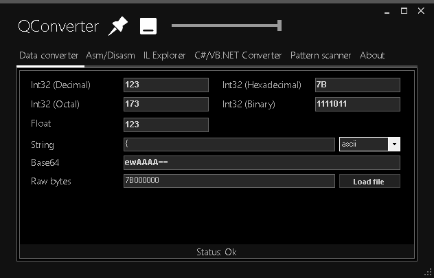
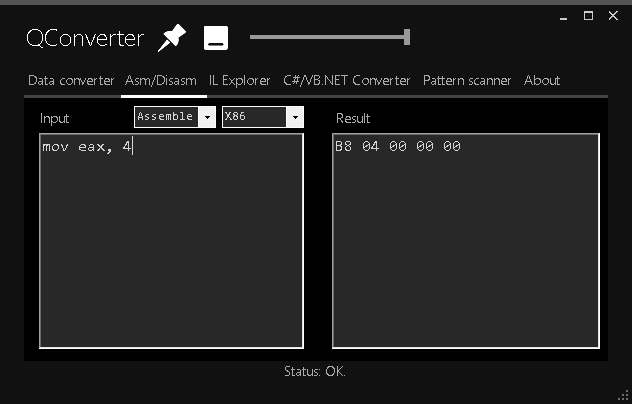
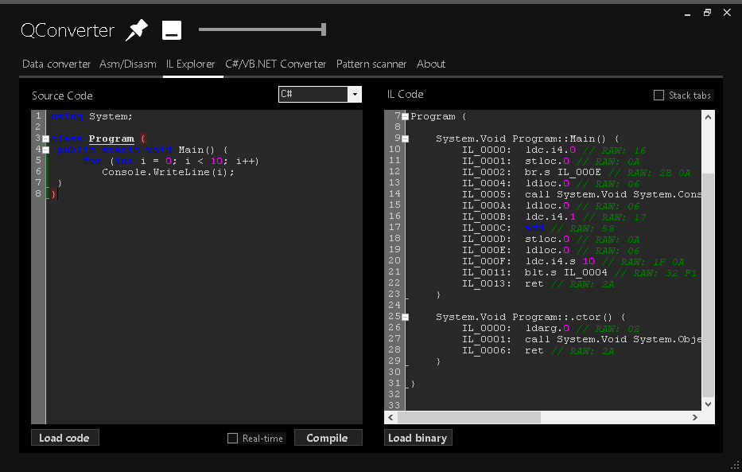
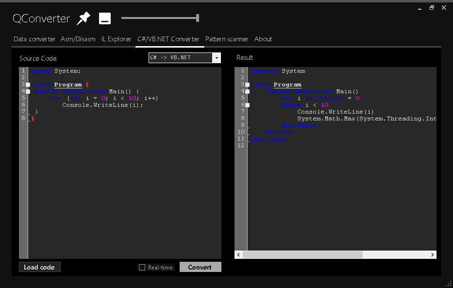
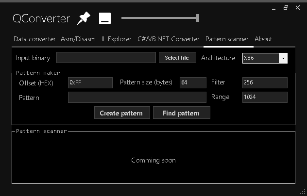

# QConverter

A multifunctional data converter for low-level developers & reverse-engineers. 

    </img>
    <text>Data converter tab</text>

 

    </img>
    <text>ASM & DISASM tab</text>

 

    </img>
    <text>C#/VB.NET -> MSIL tab</text>

 

    </img>
    <text>C# <-> VB.NET tab</text>

 

    </img>
    <text>Pattern scanner tab (unfinished)</text>

